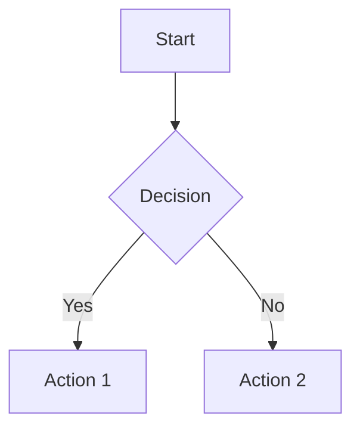

# MkDocs Configuration Reference

Complete reference for mkdocs.yml configuration.

## Site Configuration

```yaml
site_name: My Project                    # Site title
site_url: https://example.com/docs       # Production URL
site_description: A brief description    # Meta description
site_author: Your Name                   # Author metadata

# Repository
repo_name: user/repo
repo_url: https://github.com/user/repo
edit_uri: edit/main/docs/                # Edit page URL
```

## Navigation

```yaml
nav:
  - Home: index.md
  - Section:
    - Page 1: section/page1.md
    - Page 2: section/page2.md
  - External: https://example.com
```

## Black/White Color Scheme

```yaml
theme:
  name: material
  palette:
    # Light mode
    - media: "(prefers-color-scheme: light)"
      scheme: default
      primary: black
      accent: black
      toggle:
        icon: material/weather-sunny
        name: Switch to dark mode
    # Dark mode
    - media: "(prefers-color-scheme: dark)"
      scheme: slate
      primary: black
      accent: white
      toggle:
        icon: material/weather-night
        name: Switch to light mode
```

## Typography

```yaml
theme:
  font:
    text: Fira Sans        # Body text
    code: Fira Code        # Code blocks
```

## Theme Features

```yaml
theme:
  features:
    - navigation.tabs          # Top-level tabs
    - navigation.sections      # Section grouping
    - navigation.expand        # Expand sections
    - navigation.top           # Back-to-top button
    - search.highlight         # Highlight search results
    - search.suggest           # Search suggestions
    - content.code.copy        # Copy code button
    - content.code.annotate    # Code annotations
```

## Markdown Extensions

### Code Highlighting
```yaml
markdown_extensions:
  - pymdownx.highlight:
      anchor_linenums: true
      line_spans: __span
      pygments_lang_class: true
  - pymdownx.inlinehilite
  - pymdownx.snippets
  - pymdownx.superfences
```

### Admonitions (Callouts)
```yaml
markdown_extensions:
  - admonition
  - pymdownx.details
```

Usage:
```markdown
!!! note "Note Title"
    This is a note.

!!! warning
    This is a warning.

!!! tip "Pro Tip"
    Helpful advice.

!!! danger "Danger"
    Be careful!
```

### Task Lists
```yaml
markdown_extensions:
  - pymdownx.tasklist:
      custom_checkbox: true
```

Usage:
```markdown
- [x] Completed task
- [ ] Incomplete task
```

### Mermaid Diagrams
```yaml
markdown_extensions:
  - pymdownx.superfences:
      custom_fences:
        - name: mermaid
          class: mermaid
```

Usage:
````markdown

````

## Plugins

### Search
```yaml
plugins:
  - search:
      separator: '[\s\-,:!=\[\]()"`/]+'
```

### mkdocstrings (Python API)
```yaml
plugins:
  - mkdocstrings:
      handlers:
        python:
          options:
            docstring_style: google
            show_source: true
            show_root_heading: true
            merge_init_into_class: true
```

### Minify
```yaml
plugins:
  - minify:
      minify_html: true
```

## Extra CSS/JS

```yaml
extra_css:
  - stylesheets/extra.css

extra_javascript:
  - javascripts/extra.js
  - https://unpkg.com/mermaid@10/dist/mermaid.min.js
```

## Social Links

```yaml
extra:
  social:
    - icon: fontawesome/brands/github
      link: https://github.com/user
    - icon: fontawesome/brands/twitter
      link: https://twitter.com/user
```

## Complete Example

```yaml
site_name: My Project
site_url: https://example.com/docs
repo_url: https://github.com/user/repo

nav:
  - Home: index.md
  - Guide:
    - Installation: guide/installation.md
    - Usage: guide/usage.md

theme:
  name: material
  palette:
    - media: "(prefers-color-scheme: light)"
      scheme: default
      primary: black
      accent: black
    - media: "(prefers-color-scheme: dark)"
      scheme: slate
      primary: black
      accent: white
  font:
    text: Fira Sans
    code: Fira Code
  features:
    - navigation.tabs
    - content.code.copy

markdown_extensions:
  - pymdownx.highlight
  - pymdownx.superfences
  - admonition
  - attr_list

plugins:
  - search

copyright: Copyright © 2024 My Project
```

## Commands

```bash
# Development server
mkdocs serve

# Build site
mkdocs build

# Deploy to GitHub Pages
mkdocs gh-deploy

# Create new project
mkdocs new my-project
```
